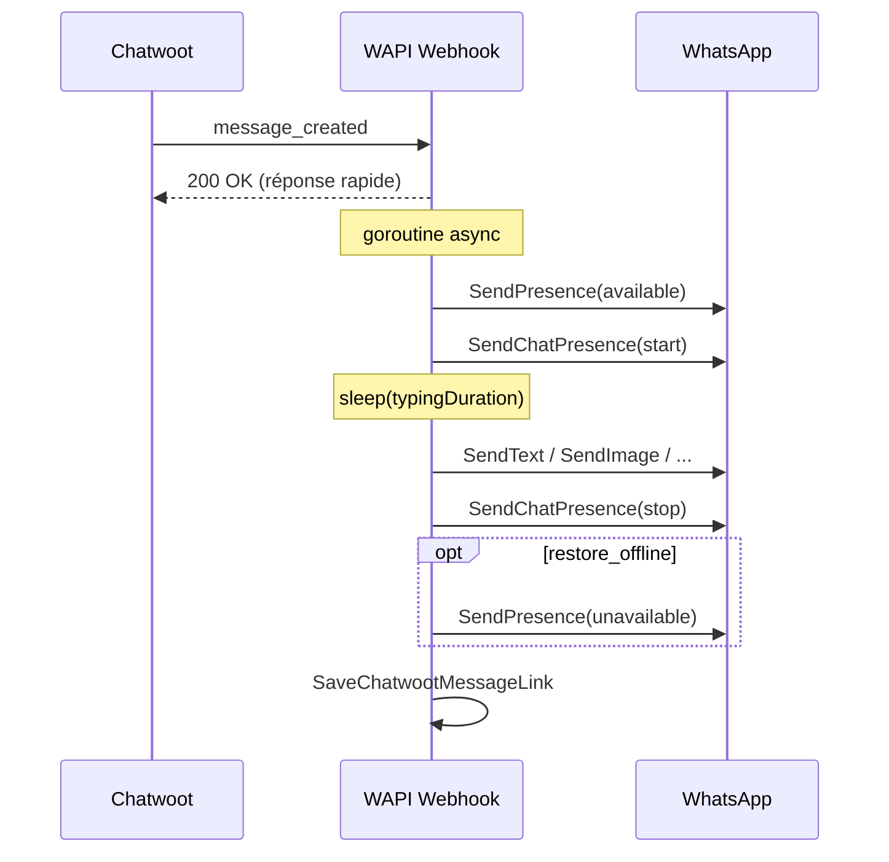

# Chatwoot → WhatsApp : livraison « humaine » (présence + frappe)

Ce document décrit le plan pour simuler un comportement humain **avant** d’envoyer un message WhatsApp déclenché par un webhook Chatwoot (`message_created`).

Il complète [chatwoot-message-edit-plan.md](./chatwoot-message-edit-plan.md) (edit/delete). Ici on ne traite que **l’envoi initial** d’un message sortant agent.

---

## Objectif

Quand un agent envoie un message depuis Chatwoot, le contact WhatsApp ne doit pas voir le message apparaître instantanément comme un bot. Le flux cible :

1. **Se mettre en ligne** (`/send/presence` → `available`)
2. **Afficher « en train d’écrire… »** (`/send/chat-presence` → `start`)
3. **Attendre un délai crédible** (fonction de la longueur / type de message)
4. **Envoyer le message** (texte ou média — flux actuel)
5. **Arrêter la frappe** (`/send/chat-presence` → `stop`)
6. **(Optionnel)** Repasser `unavailable` pour ne pas rester « en ligne » en permanence

Les appels se font via **`SendUsecase`** (comme aujourd’hui), pas via des requêtes HTTP internes vers la REST API.

---

## État actuel

| Composant | Comportement |
|-----------|--------------|
| `handleMessageCreated` | Envoie immédiatement texte / pièce jointe, puis sauve le mapping |
| `SendPresence` | `type`: `available` \| `unavailable` |
| `SendChatPresence` | `action`: `start` \| `stop` sur un `phone` / JID |
| Config globale | `WHATSAPP_PRESENCE_ON_CONNECT=unavailable` + pulse quotidien possible |

Il n’y a **aucun délai** ni séquence présence → frappe → envoi aujourd’hui.

---

## Périmètre

### Inclus

- Webhook **`message_created`**, messages **`outgoing`**, non **`private`**
- Texte et pièces jointes (image, audio, vidéo, fichier)
- Multi-device (contexte device déjà résolu dans `resolveOutboundWebhook`)

### Exclus (v1)

- **`message_updated`** (edit / delete) : pas de simulation humaine, action directe
- Webhooks **`conversation_typing_*`** : ignorés (200) — la frappe est gérée uniquement par la livraison humaine avant `message_created`
- Messages **echo** (`IsMessageSentByUs`) : inchangé, skip

---

## Séquence cible



### Pourquoi répondre 200 avant la fin ?

Les webhooks Chatwoot ont un timeout. La séquence humaine peut prendre **2–15 s**. Pattern recommandé :

1. Valider le payload + résoudre device/destination
2. Répondre **`200 OK`** immédiatement
3. Exécuter la séquence dans une **goroutine** avec `context` dérivé du device (pas `c.UserContext()` après retour HTTP)

---

## Détail des étapes (usecase)

| Étape | Usecase | Payload |
|-------|---------|---------|
| 1. En ligne | `SendPresence` | `{ "type": "available" }` |
| 2. Frappe | `SendChatPresence` | `{ "phone": "<destination>", "action": "start" }` |
| 3. Pause | `time.Sleep(typingDuration)` | voir calcul ci-dessous |
| 4. Envoi | `SendText` / `SendImage` / … | flux existant |
| 5. Stop frappe | `SendChatPresence` | `{ "phone": "<destination>", "action": "stop" }` |
| 6. Hors ligne (opt.) | `SendPresence` | `{ "type": "unavailable" }` |

`destination` = même valeur que aujourd’hui (`resolveChatwootDestination` + nettoyage JID).

### Erreurs par étape

| Étape en échec | Comportement recommandé |
|----------------|-------------------------|
| Presence `available` | Log warning, **continuer** (frappe + envoi peuvent marcher) |
| Chat presence `start` | Log warning, **continuer** avec délai minimal |
| Envoi message | Log error, **ne pas** sauver le mapping ; statut failed optionnel |
| Chat presence `stop` | Log warning seulement (message déjà parti) |
| Presence `unavailable` | Log warning seulement |

Ne jamais faire échouer le webhook HTTP après le 200 initial.

---

## Calcul du délai de frappe (`typingDuration`)

Objectif : délai crédible sans bloquer trop longtemps le support.

```text
baseMs     = config.ChatwootHumanTypingBaseMs      // ex. 800
perCharMs  = config.ChatwootHumanTypingPerCharMs   // ex. 40
minMs      = config.ChatwootHumanTypingMinMs       // ex. 1200
maxMs      = config.ChatwootHumanTypingMaxMs       // ex. 12000

chars = len(EffectiveTextContent(payload))  // 0 pour média seul

typingDuration = clamp(baseMs + chars*perCharMs, minMs, maxMs)
```

**Médias** (audio, image, vidéo, fichier) sans texte :

- Utiliser `minMs` ou une constante dédiée `mediaMs` (ex. 2500 ms)
- v2 : `ChatPresenceMedia` audio pour vocal (whatsmeow supporte `ChatPresenceMediaAudio` côté events — à valider pour l’envoi)

**Pièces jointes lourdes** : le délai simule le temps de « préparation », pas le upload ; le téléchargement URL côté WAPI reste après le sleep.

---

## Configuration proposée

Variables d’environnement / flags (priorité comme le reste du projet) :

| Variable | Défaut | Description |
|----------|--------|-------------|
| `CHATWOOT_HUMAN_DELIVERY_ENABLED` | `true` | Active la séquence avant envoi |
| `CHATWOOT_HUMAN_PRESENCE_AVAILABLE` | `true` | Étape 1 `available` |
| `CHATWOOT_HUMAN_PRESENCE_RESTORE` | `true` | Étape 6 `unavailable` après envoi |
| `CHATWOOT_HUMAN_TYPING_ENABLED` | `true` | Étapes 2 et 5 |
| `CHATWOOT_HUMAN_TYPING_BASE_MS` | `800` | Délai de base |
| `CHATWOOT_HUMAN_TYPING_PER_CHAR_MS` | `40` | Par caractère (texte) |
| `CHATWOOT_HUMAN_TYPING_MIN_MS` | `1200` | Plancher |
| `CHATWOOT_HUMAN_TYPING_MAX_MS` | `12000` | Plafond |
| `CHATWOOT_HUMAN_TYPING_MEDIA_MS` | `2500` | Délai si média sans texte |

Stockage : `config/settings.go` + binding viper dans `cmd/root.go` (comme Chatwoot / presence pulse).

---

## Interaction avec la présence globale

| Config existante | Risque | Mitigation |
|------------------|--------|------------|
| `WHATSAPP_PRESENCE_ON_CONNECT=unavailable` | Conflit peu grave : `available` ponctuel avant réponse | Documenter ; option `PRESENCE_RESTORE` |
| `WHATSAPP_PRESENCE_PULSE_ENABLED=true` | Deux sources de `available` | Acceptable ; pulse = cron, human = par message |
| Anciens webhooks `conversation_typing_*` | Plus traités | Retirés du handler ; indicateur uniquement via livraison humaine |

---

## Architecture code

### Nouveau module

```text
src/ui/rest/chatwoot_human_delivery.go   # orchestration
src/infrastructure/chatwoot/human_delivery.go   # (optionnel) calcul durée, constantes
```

### API interne suggérée

```go
type HumanDeliveryOptions struct {
    Enabled          bool
    PresenceAvailable bool
    PresenceRestore  bool
    TypingEnabled    bool
    TypingDuration   time.Duration
}

func (h *ChatwootHandler) deliverOutboundWithHumanBehavior(
    ctx context.Context,
    webhookCtx *outboundWebhookContext,
    payload chatwoot.WebhookPayload,
    deliver func(context.Context) (whatsappMessageID, messageType, lastContent string, err error),
) error
```

`handleMessageCreated` devient :

1. Résolution + filtres echo
2. `go func() { deliverOutboundWithHumanBehavior(...) }()`
3. `return 200`

`deliver` encapsule la logique actuelle texte / attachments.

### Pas de changement REST public

Les endpoints `/send/presence` et `/send/chat-presence` restent inchangés ; seul le **chemin webhook** les enchaîne.

---

## Flux décisionnel

```text
message_created reçu
  → resolveOutboundWebhook
  → echo / vide ? → 200 skip
  → CHATWOOT_HUMAN_DELIVERY_ENABLED=false ?
       → envoi synchrone actuel (sans goroutine si on garde compat)
  → sinon :
       → 200 immédiat
       → goroutine:
            runHumanSequence
            deliver()
            saveChatwootMessageLink
```

---

## Cas limites

| Cas | Traitement |
|-----|------------|
| Device déconnecté en goroutine | Log + abandon ; pas de retry Chatwoot |
| Plusieurs attachments | Une séquence humaine, puis boucle envoi (comme aujourd’hui) ; `typingDuration` basé sur caption + premier type média |
| Groupe | Même API `phone` = JID groupe ; valider avec `ValidateJidWithLogin` |
| Message très long | Plafond `maxMs` |
| Concurrence : 2 messages agent rapides | v1 : pas de mutex (2 goroutines) — acceptable ; v2 : file par `(device_id, chat_jid)` |
| `CHATWOOT_HUMAN_DELIVERY_ENABLED=false` | Comportement actuel (envoi immédiat dans le handler HTTP) |

---

## Tests

### Unitaires

- `ComputeTypingDuration(text, media, opts)` — min/max, média sans texte
- `ShouldSkipTypingStart(recentTypingEvents)` — anti-double frappe

### Intégration (mocks)

- Mock `ISendUsecase` : vérifier l’ordre des appels  
  `SendPresence(available)` → `SendChatPresence(start)` → `SendText` → `SendChatPresence(stop)` → `SendPresence(unavailable)`
- Désactivé via config : uniquement `SendText`

### Manuel

1. Agent envoie « Bonjour » depuis Chatwoot  
2. Contact voit : en ligne → frappe ~2 s → message → plus de frappe  
3. Agent envoie un audio : frappe ~2,5 s puis vocal  
4. Désactiver `CHATWOOT_HUMAN_DELIVERY_ENABLED` : envoi instantané

---

## Ordre d’implémentation

1. Ajouter les champs `config` + env / flags
2. Extraire `deliverMessageCreated(...)` depuis `handleMessageCreated`
3. Implémenter `deliverOutboundWithHumanBehavior` (synchrone d’abord, pour tests)
4. Passer en **goroutine + 200 immédiat**
5. Option restore `unavailable` + logs structurés
6. Tests unitaires + mise à jour `docs/chatwoot.md` (section comportement humain)
7. (v2) Mutex par conversation, `ChatPresenceMedia` pour audio

---

## Résumé

| Question | Décision |
|----------|----------|
| Où brancher ? | `handleMessageCreated` uniquement |
| HTTP interne ? | Non — `SendUsecase` direct |
| Webhook bloquant ? | Non — 200 puis goroutine |
| Présence après envoi ? | `unavailable` configurable (recommandé si connect = unavailable) |
| Edit / delete ? | Hors scope v1 |

## Implémentation (fait)

- Config : `config/settings.go`, flags/env dans `cmd/root.go`, `src/.env.example`
- Calcul délai : `src/infrastructure/chatwoot/human_delivery.go`
- Orchestration : `src/ui/rest/chatwoot_human_delivery.go`
- Branchement : `handleMessageCreated` dans `src/ui/rest/chatwoot_webhook.go` (goroutine + 200 si activé)

Désactiver : `CHATWOOT_HUMAN_DELIVERY_ENABLED=false` ou `--chatwoot-human-delivery-enabled=false`.
